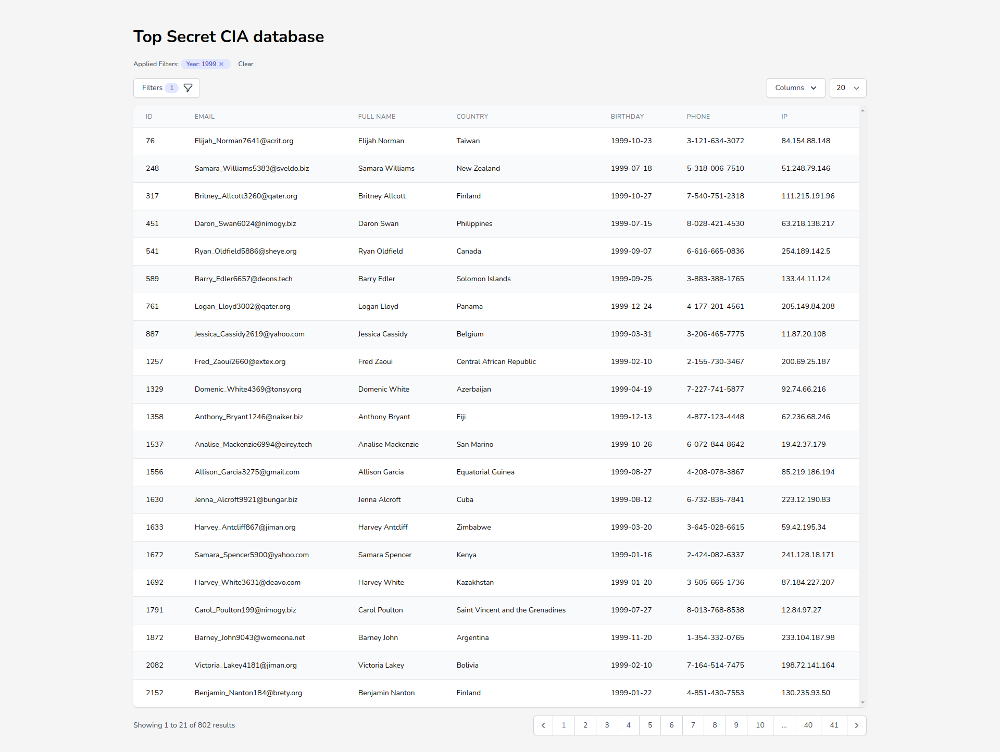

### Prerequisite
- [Docker](https://docs.docker.com/engine/install/ubuntu/)
- [NVM](https://github.com/nvm-sh/nvm) or [Node.js 16](https://nodejs.org/en/download/)

### Get Started (locally)
- Clone and go to project root folder
- Run `./vendor/bin/sail up`
- After service up an running execute `./vendor/bin/sail artisan migrate`
- To add seed data run `./vendor/bin/sail artisan db:seed --class=PersonSeeder`
- On another terminal run `nvm use && npm i && npm run dev`
- Open http://localhost 

### This is how it looks like

